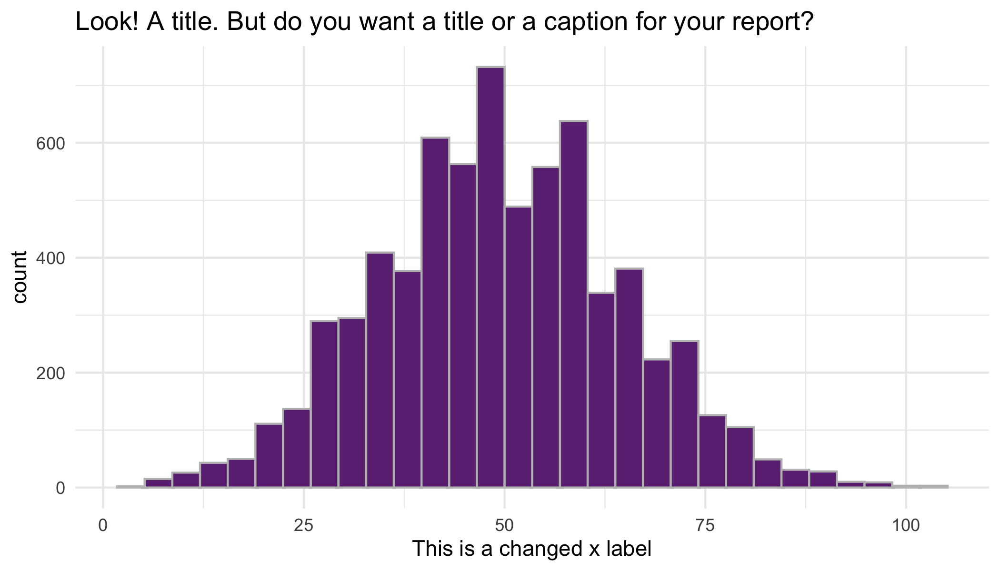

```{r, message = FALSE, echo=FALSE}
library(tidyverse)
# this should supress all code and messages
knitr::opts_chunk$set(include=FALSE)
```

# General comments (you can delete this section)

_You can delete this section, and if you want to check what it said, just open a template from the package again. You don't have to use this particular template, but you DO need to write you report in RMarkdown and include a cover page._

_The cover page must have:_

*	_A title and subtitle_
* _"Report prepared for Black Saber Software by" your company name_
*	_Date (assessment submission date is fine)_

_You can change the colour of this cover to any colour you would like by replacing 6C3082 in the YAML above (line 11) to another hex code. You could use this tool to help you:_ https://htmlcolorcodes.com/color-picker/

\newpage
# Executive summary

_Guidelines for the executive summary:_

* _No more than two pages_
* _Language is appropriate for a non-technical audience_
* _Bullet points are used where appropriate_
*	_A small number of key visualizations and/or tables are included_
*	_All three research questions are addressed_


\newpage
# Technical report
_This part of the report is much more comprehensive than the executive summary. The audience is statistics/data-minded people, but you should NOT include code or unformatted R output here._


## Introduction

_Provide a brief introduction to your report and outline what the report will cover. This section is valuable for setting scope and expectations. _

### Research questions
_Use bullet points to to describe the research questions you are going to address. Write in full sentences._

## Informative title for section addressing a research question

_For each research question, you will want to briefly describe any data manipulation, show some exploratory plots/summary tables, report on any methods you use (i.e. models you fit) and the conclusions you draw from these_

```{r}
# This chunk provides an example of some things you can do with RMarkdown to make your report creation process easier
#checking github
# read in the data

black_saber_current_employees <- read_csv("data/black-saber-current-employees.csv")

##3 PHASES 
phase1 <- 
  read.csv("data/phase1-new-grad-applicants-2020.csv")
phase2 <- 
  read.csv("data/phase2-new-grad-applicants-2020.csv")
phase3 <- 
  read.csv("data/phase3-new-grad-applicants-2020.csv")

# create a visualisation
my_plot <- black_saber_current_employees %>% 
  ggplot(aes(x = productivity)) +
  geom_histogram(colour = "grey", fill = "#6C3082") +
  theme_minimal() +
  labs(title = "Look! A title. But do you want a title or a caption for your report?", x = "This is a changed x label")

# save your plot in your images folder, you can specify the height and width, too
# saving this means you can add the image to your exectuve summary without having to run or rerun the code, if you wish
ggsave("images/example.png", width = 7, height = 4)

# norice how the image is included with the  below
```



## First general plot, number of workers by gender in each role 

```{r, ECHO = TRUE, fig.width= 20, fig.height=30}
roles = c("Entry-level", "Junior I", "Junior II", "Senior I", "Senior II", "Senior III", "Manager", "Director", "Vice president")
promotions <- black_saber_current_employees %>% mutate("role_seniority" = factor(role_seniority, levels = roles)) %>% mutate("order" = as.numeric(role_seniority)/100)

ggplot(data = promotions, aes(x = factor(order), fill = gender)) + 
  geom_bar(data = dplyr::filter(promotions, gender=="Woman")) + geom_bar(data = dplyr::filter(promotions, gender=="Prefer not to say")) +
  geom_bar(data = dplyr::filter(promotions, gender=="Man"),aes(y=..count..*(-1))) + 
  scale_x_discrete(labels = roles) +
  xlab("roles") +
  coord_flip() +
  theme(text = element_text(size=12)) +
  scale_y_continuous(breaks=seq(-100,100,50),labels=abs(seq(-100,100,50))) + 
  scale_fill_brewer(palette="Dark2") +
  facet_wrap(~financial_q)
```
Visually, we can see that as Black Saber grew and hired more people, there seems to be slightly more women in entry level roles than men. On the other hand, while we move into the more senior roles, there seems to be more men. This is something we want to consider and look out for in our analysis. Is this simply due to chance? Are men in these roles because they are on average more suited for them by looking into factors such as productivity and leadership/ Or does Black Saber have a bias towards promoting men. This plot was made referencing Robert Lanfear's blog post https://www.robertlanfear.com/blog/files/visualising_gender_balance_R.html.

#Models - using GLM 
First, we changed the way some of our categorical factors were encoded into numbers. 
- something to consider, cant use a linear model since we have several employees over several years, people with more years of experience are probably more likely to be promoted than entry-levels/new employees 
#Data Manipulation 
```{r,}
#want to count the number of times a person has been promoted 
library(lme4)

promotions <- promotions %>% mutate(gender = factor(gender)) %>% mutate(gender =  fct_relevel(gender, "Woman", after = 1)) %>% 
mutate(leadership_for_level = factor(leadership_for_level)) %>% 
mutate(role_seniority = factor(role_seniority)) %>% mutate_if(is.factor, as.numeric) %>% group_by(employee_id) %>% arrange(financial_q) %>% mutate("promoted" = ifelse(role_seniority > lag(role_seniority), 1, 0)) %>% mutate(promoted = factor(promoted))  
#changing NAs 
promotions <- promotions %>% mutate(promoted = replace_na(promoted,0))

 #(1+gender|seniority) gives us means for seniority 
```
#Using GLM and Logistic Regression to Answer: Are men more likely to be promoted? 
```{r,}
ggplot(promotions, aes(promoted)) + geom_bar(aes(fill = gender)) + theme_classic()
```
#Models
```{r,}

simple <- lm(role_seniority ~ gender, data = promotions)

promo <- lmer(role_seniority ~ (1|employee_id) + gender, data = promotions)


  
```

```{r,}
#Make different models and compare the difference when adding things like random effects on role seniority 
#also if there is bias, then holding factors like productivity and leadership constant between both genders to our model should produce different results? because holding them constant would mean that for that role, any gender would be suited for the job because they have the same skill set, so gender shouldnt matter 
#could may do a log reg? like calculate the likelihood of men getting promoted vs women? 
#primary response is role_seniority? 
promotions <- promotions %>% mutate("leadership_for_level" = factor(leadership_for_level, levels = c("Needs improvement", "Appropriate for level","Exceeds expectations"))) #changed to factor since we want to look at the levels of leadership on the promotions 


```

## Salary - combining yian and claire's stuff 

```{r, warning=FALSE, message=FALSE}
current_employees = read_csv("data/black-saber-current-employees.csv")
unique(current_employees$team) # what teams are there?
count(current_employees, gender) #counts for everything, put these into a table but also do this for the hiring section
# note that we need to add a random effect for ID !!!!!! regardless!!!! 
```

```{r}
current_employees = current_employees %>% mutate(salary = str_remove_all(salary,'\\$')) %>% mutate(salary = str_remove_all(salary, ",")) %>% mutate(salary = as.numeric(salary)) %>% mutate(gender = factor(gender)) %>% mutate(gender = fct_relevel(gender, "Woman", after = 1))

#want to visualize mean salary for each financial quarter per gender - helpful table but idk how to visualize
genderprop <- current_employees%>% group_by(gender,financial_q) %>% summarise(gendercount = n(), meansalary = mean(salary)) 

salary_by_quarter_gender <- ggplot(genderprop, aes(x= financial_q, y = meansalary)) + geom_bar(aes(fill = gender), position = "dodge", stat = "identity", width = 0.7) + theme(axis.text.x = element_text(angle = 90)) #CHANGE COLOUR AND TITLES 
salary_by_quarter_gender

```

this plot tells us, as the company was starting, women and prefer not to say, on average were making more, however, as we move closer to 2020, we see men beginning to make more. Is this difference significant? 
```{r,}
sum(genderprop$gendercount)
current_males = current_employees %>% 
  filter(gender=="Man")
mean(current_males$salary)

current_females = current_employees %>% 
  filter(gender=="Woman")
mean(current_females$salary)

current_other = current_employees %>% 
  filter(gender=="Prefer not to say")
mean(current_other$salary)

# put these values into a table
#looks okay but males seem higher so lets check it out
```

```{r}
# more wrangling!!
# 1) should productivity be binary? <50 = not satisfactory = 50: satisfactory, >50: better than expected ... maybe not
# 2) leadership for level.... 
# 3) should we look at the average amount of time someone stays in thecompany depending on gender? that would just be the average amount of times their ID shows up
#average retention rate!
m_retention = count(current_males, employee_id)
mean(m_retention$n/4)
f_retention = count(current_females, employee_id)
mean(f_retention$n/4)
o_retention = count(current_other, employee_id)
mean(o_retention$n/4)
# how do we compare these to see if they're significant ?
```
```{r}
current_employees %>%
ggplot(aes(x = gender, y = salary, colour = role_seniority)) +
geom_boxplot() +
facet_wrap(~role_seniority) +
theme_minimal() +
theme(legend.position = "none", axis.text.y = element_blank()) +
labs(x = "Sex", y = "Salary") #Change colours
```
at first glance the salaries per seniority level per gender is generally even, though women seem to be less than men... let's investigate if this is significant or not

```{r}
current_employees %>%
  mutate(role_seniority = factor(role_seniority, c("Entry-level","Junior I","Junior II","Senior I","Senior II","Senior III","Manager", "Director","Vice president"))) %>% 
ggplot(aes(x = role_seniority, y = productivity, colour = role_seniority)) +
geom_boxplot() +
#facet_wrap(~role_seniority) +
theme_minimal() +
theme(legend.position = "none", axis.text.y = element_blank()) +
labs(x = "Seniority Level", y = "Salary")
```
lol wait why is entry level mean being paid more? We expect to see an upward trend...

We want to investigate whether or not the salaries are fair based on talent and value...
The factors we want to use to investigate in that are the leadership and seniority, and productivity, i think that's what talent and value are based in right?
```{r}
# i know we need a random effect for (1+leadership | role_seniority) BECAUSE the leadership is dependent on their seniority, so like... the seniority is the random effect, but then there is a fixed effect for leadership *within* that role....
# buttttt what model do we run? 
model_sal = lmer(salary~gender+(1|employee_id)+(1|team)+(1|role_seniority), data=current_employees)
summary(model_sal)
model_sal2 = lmer(salary~gender+(1|employee_id)+(1|role_seniority), data=current_employees)
summary(model_sal2)
model_sal3 = lmer(salary~(1|employee_id)+(1|team)+(1|role_seniority), data=current_employees)
summary(model_sal3)
model_sal4 = lmer(salary~gender+(1|employee_id)+(1|team), data=current_employees)
summary(model_sal4) #removed role seniority random effect... test for difference
lmtest::lrtest(model_sal, model_sal2)
#this shows us that salaries differ depending on teams, so we use the more complex model to investigate the diff between gender
lmtest::lrtest(model_sal3, model_sal)
#significaant result.... when we have a fixed effect for gender, then the models differ, which means that salary might be biased, holding these random effects 
lmtest::lrtest(model_sal, model_sal4) #ok there is a difference, between RE for seniority or not so it has to be something else affecting it... 
#these test tells use we should probably use model_sal 

#should we have a random slope with leadership level and role seniority? 
model_sal5 = lmer(salary~gender+(1|employee_id)+(1|team)+(1+ leadership_for_level|role_seniority), data=current_employees) #added random slope because leadership requirements are different for different roles 
lmtest::lrtest(model_sal, model_sal5) #this tells us that there is an interaction between leadership and role seniority --> significant use model_sal5 
#lastly, does productivity effect how much someone is paid? 
model_sal6= lmer(salary~gender+(1|employee_id)+(1|team)+(1+ leadership_for_level|role_seniority) + (1|productivity), data=current_employees) #productivity added as a RE since it is different per employee
lmtest::lrtest(model_sal5, model_sal6) #model_sal6 seems to be significant- use as final model 
final_sal_model <- model_sal6

#Looks like we have found the best model to describe our data, now we wanted to see how including gender vs not including it effects our model 
finalmodel_nogender <- lmer(salary ~ (1|employee_id)+(1|team)+(1+ leadership_for_level|role_seniority) + (1|productivity), data=current_employees)

lmtest::lrtest(final_sal_model,finalmodel_nogender)
#more complicated final model with gender as a fixed effect explains our data better. We have strong evidence against the null hypothesis that the simpler model without gender fits the data just as well 
summary(final_sal_model)
```
Through creating various models to test different fixed and random effects in our data, we found that gender is a significant fixed effect in our model (when controlling for other variables that may contribute to salary). That is we saw that gender does in fact impact the expected salary we can expect to see from an employee. 

More specifically, we can expect to see women and those who have indicated "prefer not to say" under gender making approximately \[$2248.2\] and \[$1104.1\] less respectively than their male counterparts.    

```


## Discussion

_In this section you will summarize your findings across all the research questions and discuss the strengths and limitations of your work. It doesn't have to be long, but keep in mind that often people will just skim the intro and the discussion of a document like this, so make sure it is useful as a semi-standalone section (doesn't have to be completely standalone like the executive summary)._

### Strengths and limitations

\newpage
# Consultant information
## Consultant profiles

*Complete this section with a brief bio for each member of your group. If you are completing the project individually, you only need to complete one for yourself. In that case, change the title of this section to 'Consultant profile' instead. Examples below. This section is only marked for completeness, clarity and professionalism, not 'truth' so you can write it as if we're a few years in the future. Put your current degree in as completed and/or add your first choice grad school program, whatever you like. What skills related skills would you most like to highlight? What job title do you want?*

**Statsy McStatsstats**. Statsy is a senior consultant with Eminence Analytics. She specializes in data visualization. Statsy earned her Bachelor of Science, Specialist in Statistics Methods and Practice, from the University of Toronto in 2023.

**Datana Scatterplot**. Datana is a junior consultant with Eminence Analytics. They specialize in reproducible analysis and statistical communication. Datana earned their Bachelor of Science, Majoring in Computer Science and Statistics from the University of Toronto in 2024.

## Code of ethical conduct

_This section should be fairly short, no more than half a page. Assume a general audience, much like your executive summary._

* _Make at least three relevant statements about your company’s approach to ethical statistical consulting. These should be appropriately in line with professional conduct advice like the (Statistical Society of Canada Code of Conduct)[https://ssc.ca/sites/default/files/data/Members/public/Accreditation/ethics_e.pdf] or the (Ethical Guidelines for Statistical Practice from the American Statistical Society)[https://www.amstat.org/ASA/Your-Career/Ethical-Guidelines-for-Statistical-Practice.aspx]. For example, "the customer is always right" ISN’T the type of thing an ethical statistical consultant would include._
*	_Be very careful not to just copy and paste from these other documents! Put things in your own words._


__Final advice: KNIT EARLY AND OFTEN!__