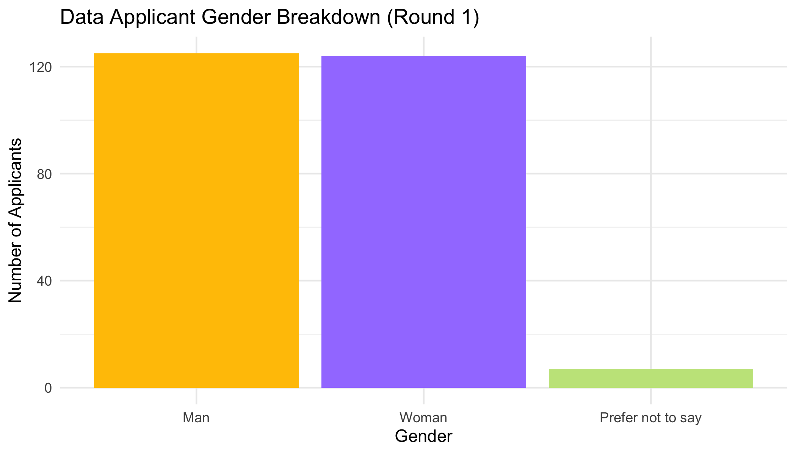
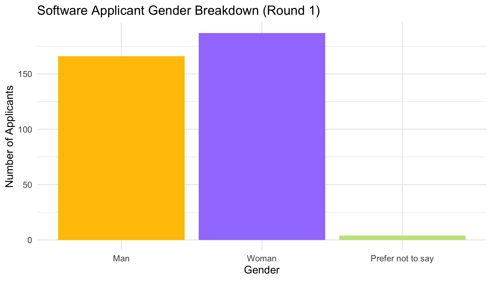
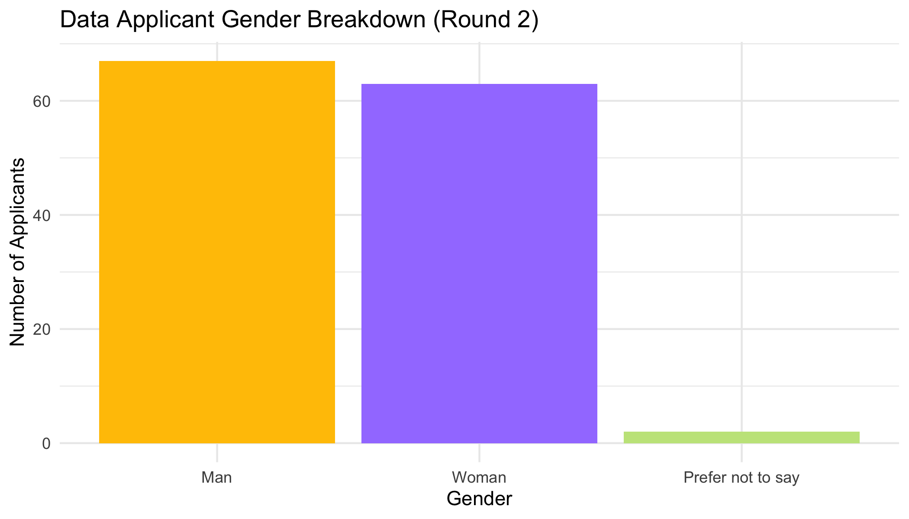

```{r, message = FALSE, echo=FALSE}
library(tidyverse)
# this should suppress all code and messages
knitr::opts_chunk$set(include=FALSE)
```

# General comments (you can delete this section)

_You can delete this section, and if you want to check what it said, just open a template from the package again. You don't have to use this particular template, but you DO need to write you report in RMarkdown and include a cover page._

_The cover page must have:_

*	_A title and subtitle_
* _"Report prepared for Black Saber Software by" your company name_
*	_Date (assessment submission date is fine)_

_You can change the colour of this cover to any colour you would like by replacing 6C3082 in the YAML above (line 11) to another hex code. You could use this tool to help you:_ https://htmlcolorcodes.com/color-picker/

\newpage
# Executive summary

_Guidelines for the executive summary:_

* _No more than two pages_
* _Language is appropriate for a non-technical audience_
* _Bullet points are used where appropriate_
*	_A small number of key visualizations and/or tables are included_
*	_All three research questions are addressed_


\newpage
# Technical report
_This part of the report is much more comprehensive than the executive summary. The audience is statistics/data-minded people, but you should NOT include code or unformatted R output here._


## Introduction


_Provide a brief introduction to your report and outline what the report will cover. This section is valuable for setting scope and expectations. _
### Background

### Research questions
_Use bullet points to to describe the research questions you are going to address. Write in full sentences._
Hiring
Promotion

## Hiring Process

```{r, include = FALSE}
library(tidyverse)
library(lme4)
library(mgcv)
```


```{r, warning=FALSE, message=FALSE}
phase1 = read_csv("data/phase1-new-grad-applicants-2020.csv")
phase2 = read_csv("data/phase2-new-grad-applicants-2020.csv")
phase3 = read_csv("data/phase3-new-grad-applicants-2020.csv")
final_hires = read_csv("data/final-hires-newgrad_2020.csv")
```

```{r}
#checking to see if datasets have NAs to see (1) if we need to do anything about them (2) so we can filter them out in the next round when we're seeing who got into the next round
sum(is.na(phase1))
sum(is.na(phase2)) 
sum(is.na(phase3))
```

### Round 1
```{r}
round1_2 = full_join(phase1, phase2)
round1_2 = round1_2 %>% 
  #technical skills is only under hiring2, which means if an applicant's id has NA for this column, they did not move onto the next round
  mutate(next_round = !is.na(technical_skills)) %>%  
  mutate(next_round = as.integer(next_round)) %>% 
  select(-c(technical_skills, writing_skills, leadership_presence, speaking_skills)) #remove phase 2 data

#split into software/data
round1_data = round1_2 %>% 
  filter(team_applied_for == "Data") %>% 
  mutate(gender = fct_relevel(gender, "Prefer not to say", after = 2))

round1_software = round1_2 %>% 
  filter(team_applied_for == "Software") %>% 
  mutate(gender = fct_relevel(gender, "Prefer not to say", after = 2))
```

``` {r}
#see m/f/other demographics within each data/software applicant pool
# visualizations

r1_data_gender_plot = round1_data %>% 
  ggplot(aes(x = gender)) + geom_bar(fill = c("#FFC300", "#A381FF", "#C4E48A")) +
  #geom_histogram(colour = "grey", fill = "#6C3082") +
  theme_minimal() +
  labs(title = "Data Applicant Gender Breakdown (Round 1)", x = "Gender", y = "Number of Applicants") 
#do we want a title or a caption for this?
r1_data_gender_plot
ggsave("images/r1_data_gender_plot.png", width = 7, height = 4)

r1_software_gender_plot = round1_software %>% 
  ggplot(aes(x = gender)) + geom_bar(fill = c("#FFC300", "#A381FF", "#C4E48A")) +
  #geom_histogram(colour = "grey", fill = "#6C3082") +
  theme_minimal() +
  labs(title = "Software Applicant Gender Breakdown (Round 1)", x = "Gender", y = "Number of Applicants")
r1_software_gender_plot
#do we want a title or a caption for this?
ggsave("images/r1_software_gender_plot.png", width = 7, height = 4)
```



```{r}
#get counts for each gender in data -> for report
table(round1_data$gender)
#get counts for each gender in software -> for report
table(round1_software$gender)
```

<!-- by the looks of it the applicant pool is pretty even but lets go forward with investigating in case -->

```{r}

#response is binary so we use glm bc family

#normal linear model
hiring1_model = glm(next_round ~ cv + gpa + cover_letter, family = binomial(link = "logit"), data = round1_2)
summary(hiring1_model)

# add fixed effect for gender
hiring1_gender_model = glm(next_round ~ cv + gpa + cover_letter + gender,#(1 | gender),#(1 + genre | artist_name), 
                data = round1_2, family = binomial(link = "logit"))
summary(hiring1_gender_model)

#let's see if we add an effect for team applied to - maybe the process for data and software are different?
hiring1_team_gender = glmer(next_round ~ cv + gpa + cover_letter + gender + (1 |team_applied_for),
                data = round1_2, family = binomial(link = "logit"), nAGQ=0)

summary(hiring1_team_gender)

#compare the effect between gender only and gender (rand int) + random slope for team 
lmtest::lrtest(hiring1_gender_model, hiring1_team_gender)
#hmm seems like not significant effect... we can continue with our simpler model
#test the simple model against the original model with no random intercept for gender...investigate if there is a difference
lmtest::lrtest(hiring1_model, hiring1_gender_model)

#chi^2 p value small for both of them which means theres no difference in models if u add effect for gender, meaning model doesnt change based on gender and therefore there is no evidence of there being bias in phase 1 of the hiring process.


```

<!-- these models are confirmed by the fact that in round 2, the gender breakdown is pretty even  -->

### Round 2
```{r}
round2_3 = full_join(phase2, phase3)
#remove phase 2 columns
round2_3 = round2_3 %>% 
  #technical skills is only under hiring2, which means if an applicant's id has NA for this column, they did not move onto the next round
  mutate(next_round = !is.na(interviewer_rating_1)) %>%  
  mutate(next_round = as.integer(next_round)) %>% 
  select(-c(cover_letter, cv, gpa, extracurriculars, work_experience, interviewer_rating_1, interviewer_rating_2)) #remove phase 2 data

#split into software/data
round2_data = round2_3 %>% 
  filter(team_applied_for == "Data") %>% 
  mutate(gender = fct_relevel(gender, "Prefer not to say", after = 2))

round2_software = round2_3 %>% 
  filter(team_applied_for == "Software") %>% 
  mutate(gender = fct_relevel(gender, "Prefer not to say", after = 2))
```

``` {r}
#see m/f/other demographics within each data/software applicant pool
# visualizations

r2_data_gender_plot = round2_data %>% 
  ggplot(aes(x = gender)) + geom_bar(fill = c("#FFC300", "#A381FF", "#C4E48A")) +
  #geom_histogram(colour = "grey", fill = "#6C3082") +
  theme_minimal() +
  labs(title = "Data Applicant Gender Breakdown (Round 2)", x = "Gender", y = "Number of Applicants") 
#do we want a title or a caption for this?
r2_data_gender_plot
ggsave("images/r2_data_gender_plot.png", width = 7, height = 4)

r2_software_gender_plot = round2_software %>% 
  ggplot(aes(x = gender)) + geom_bar(fill = c("#FFC300", "#A381FF", "#C4E48A")) +
  #geom_histogram(colour = "grey", fill = "#6C3082") +
  theme_minimal() +
  labs(title = "Software Applicant Gender Breakdown (Round 2)", x = "Gender", y = "Number of Applicants")
r2_software_gender_plot
#do we want a title or a caption for this?
ggsave("images/r2_software_gender_plot.png", width = 7, height = 4)

# we should only visualize this without the diff teams... 
```


```{r}
#get counts for each gender in data -> for report
table(round2_data$gender)
#get counts for each gender in software -> for report
table(round2_software$gender)
# get percentages
```

```{r}

#normal linear model
hiring2_model = glm(next_round ~ technical_skills + writing_skills + leadership_presence + speaking_skills, family = binomial(link = "logit"), data = round2_3)
summary(hiring2_model)


# add fixed effect for gender
hiring2_gender_model = glm(next_round ~ technical_skills + writing_skills + leadership_presence + speaking_skills + gender, data = round2_3, family = binomial(link = "logit"))

summary(hiring2_gender_model)

#let's see if we add an effect for team applied to - maybe the process for data and software are different?
hiring2_team_gender = glmer(next_round ~ technical_skills + writing_skills + leadership_presence + speaking_skills + gender + (1 | team_applied_for),
                data = round2_3, family = binomial(link = "logit"), nAGQ=0)

summary(hiring2_team_gender)


#compare the effect between gender only and gender (rand int) + random slope for team 
lmtest::lrtest(hiring2_gender_model, hiring2_team_gender)
#hmm seems like not significant effect... we can continue with our simpler model without the difference between teams
#test the simple model against the original model with no random intercept for gender...investigate if there is a difference

lmtest::lrtest(hiring2_model, hiring2_gender_model)
#since all these models are nested we can use lmtest to compare them... 
#confint()

#high chi squared for both - we're good! no diff between model that seps gender 
```

```{r, warning=FALSE, message=FALSE}
coef(hiring2_gender_model)

exp(coef(hiring2_gender_model)) #?
confint(hiring2_gender_model)
```

holding everything else constant, the odds of a female getting hired is 5.674635e-01 compared to odds of men and odds of "PNTS" is 9.287746e-08 compared to odds of men (?)

anywayyyy 
looking at the 95% confidence interval, we can see that 0 lies within the interval for women - thus we can say that there is insufficient evidence to suggest that gender is associated with getting hired. 

```{r, warning=FALSE, message=FALSE}
par_table = cbind(est = summary(
hiring2_gender_model)$coef[,1],
confint(hiring2_gender_model))
rownames(par_table)[1]= "Baseline"
par_table
```
```{r}
#centering - idk if i should/need to do this - idts
quantile(round2_3$technical_skills)
quantile(round2_3$writing_skills)
quantile(round2_3$leadership_presence)
quantile(round2_3$speaking_skills)

#exp(par_table[1,'est'])/(1+exp(par_table[1,'est'])) 
```


### Round 3
```{r}
#combined stats of ppl that applied in round 3
round3_combined = right_join(phase2, phase3)
round3_combined = round3_combined %>% 
  select(applicant_id, team_applied_for, gender,interviewer_rating_1,interviewer_rating_2)

#people from round 3 who were hired
round3_h_int = right_join(round3_combined, final_hires)
round3_h_int = round3_h_int %>% 
  mutate(hired = 1)

round3_hired = full_join(round3_combined, round3_h_int)
#remove phase 2 columns
round3_hired = round3_hired %>% 
  #technical skills is only under hiring2, which means if an applicant's id has NA for this column, they did not move onto the next round
  mutate_if(is.numeric, replace_na, replace = 0) %>% 
  mutate(avg_interview = (interviewer_rating_1 + interviewer_rating_2)/2) # we see that those with the highest avg score get hired so i'm going to consolidate them 
```

```{r}
model = glm(hired ~ avg_interview, family = binomial(link='logit'), data = round3_hired)
summary(model)

model2 = glm(hired ~ avg_interview + gender, family = binomial(link='logit'), data = round3_hired)
summary(model2)

#only one woman for each team was hired, let's just assume that we do not need to take into account the team applied for since the ratio is pretty even

#model = glmer(hired ~ interviewer_rating_1 + interviewer_rating_2 + gender + (1|team_applied_for), family = binomial(link='logit'), data = round3_hired)
#summary(model)

lmtest::lrtest(model, model2)
```

not signif at the 5% level... it is at the 10% level tho so let's investigate whether or not the interviewers (human part) is biased...
we probably see a discrepency because of the systematic barriers women face in other professional spheres - the people interviewing though should be careful... let's look at the % of women removed from this level vs not...

```{r}
#todo
```

```{r}
#split into data/software
round3_data = round3_hired %>% 
  filter(team_applied_for == "Data") 
# no more "prefer not to say" so we don't need to rearrange
#%>% 
  #mutate(gender = fct_relevel(gender, "Prefer not to say", after = 2))

round3_software = round3_hired %>% 
  filter(team_applied_for == "Software") #%>% 
  #mutate(gender = fct_relevel(gender, "Prefer not to say", after = 2))

#separate by gender
round3_woman = round3_hired %>% 
  filter(gender == "Woman")

round3_man = round3_hired %>% 
  filter(gender == "Man")

mean(round3_woman$avg_interview)
mean(round3_man$avg_interview)
```


```{r}
#visualizations of round 3 applicants 
r3_data_gender_plot = round3_data %>% 
  ggplot(aes(x = gender)) + geom_bar(fill = c("#FFC300", "#A381FF")) +
  #geom_histogram(colour = "grey", fill = "#6C3082") +
  theme_minimal() +
  labs(title = "Data Applicant Gender Breakdown (Round 3)", x = "Gender", y = "Number of Applicants") 
#do we want a title or a caption for this?
r3_data_gender_plot
ggsave("images/r3_data_gender_plot.png", width = 7, height = 4)

r3_software_gender_plot = round3_software %>% 
  ggplot(aes(x = gender)) + geom_bar(fill = c("#FFC300", "#A381FF")) +
  #geom_histogram(colour = "grey", fill = "#6C3082") +
  theme_minimal() +
  labs(title = "Software Applicant Gender Breakdown (Round 3)", x = "Gender", y = "Number of Applicants")
r3_software_gender_plot
#do we want a title or a caption for this?
ggsave("images/r3_software_gender_plot.png", width = 7, height = 4)
```


_For each research question, you will want to briefly describe any data manipulation, show some exploratory plots/summary tables, report on any methods you use (i.e. models you fit) and the conclusions you draw from these_

```{r}
#get counts for each gender in data -> for report
table(round3_data$gender)
#get counts for each gender in software -> for report
table(round3_software$gender)
```

### Final Hires

```{r}

final_combined = round3_h_int %>% 
  select(applicant_id, team_applied_for, gender)#= right_join(round3_combined, final_hires)

#split into data/software
hired_data = final_combined %>% 
  filter(team_applied_for == "Data") 

hired_software = final_combined %>% 
  filter(team_applied_for == "Software")

```

```{r}
#visualization
final_data_gender_plot = hired_data %>% 
  ggplot(aes(x = gender)) + geom_bar(fill = c("#FFC300", "#A381FF")) +
  #geom_histogram(colour = "grey", fill = "#6C3082") +
  theme_minimal() +
  labs(title = "Final Hires Gender Breakdown (Data Team)", x = "Gender", y = "Number of Applicants") 
#do we want a title or a caption for this?
final_data_gender_plot
ggsave("images/final_data_gender_plot.png", width = 7, height = 4)

final_software_gender_plot = hired_data %>% 
  ggplot(aes(x = gender)) + geom_bar(fill = c("#FFC300", "#A381FF")) +
  #geom_histogram(colour = "grey", fill = "#6C3082") +
  theme_minimal() +
  labs(title = "Final Hires Gender Breakdown (Software Team)", x = "Gender", y = "Number of Applicants")
final_software_gender_plot
#do we want a title or a caption for this?
ggsave("images/final_software_gender_plot.png", width = 7, height = 4)
```
 
<!-- add caption lmao -->

```{r}
#get counts for each gender in data -> for report
table(hired_data$gender)
#get counts for each gender in software -> for report
table(hired_software$gender)
```

```{r}
# This chunk provides an example of some things you can do with RMarkdown to make your report creation process easier

# read in the data
black_saber_current_employees <- read_csv("data/black-saber-current-employees.csv")

# create a visualisation
my_plot <- black_saber_current_employees %>% 
  ggplot(aes(x = salary)) +
  geom_bar(colour = "grey", fill = "#6C3082") +
  theme_minimal() +
  labs(title = "Look! A title. But do you want a title or a caption for your report?", x = "This is a changed x label")

# save your plot in your images folder, you can specify the height and width, too
# saving this means you can add the image to your exectuve summary without having to run or rerun the code, if you wish
#ggsave("images/example.png", width = 7, height = 4)
my_plot
# norice how the image is included with the  below
```


## Promotions 

## Salary

```{r, warning=FALSE, message=FALSE}
current_employees = read_csv("data/black-saber-current-employees.csv")
unique(current_employees$team) # what teams are there?
count(current_employees, gender) #counts for everything, put these into a table but also do this for the hiring section

# note that we need to add a random effect for ID !!!!!! regardless!!!! 
```

```{r}
current_employees = current_employees %>% 
  mutate(salary = str_remove(salary, "[$,`,`]")) %>% 
  mutate(salary = as.numeric(salary))

current_males = current_employees %>% 
  filter(gender=="Man")

mean(current_males$salary)


current_females = current_employees %>% 
  filter(gender=="Woman")


mean(current_females$salary)

current_other = current_employees %>% 
  filter(gender=="Prefer not to say")


mean(current_other$salary)

# put these values into a table

#looks okay but males seem higher so lets check it out
```

```{r}
# more wrangling!!
# 1) should productivity be binary? <50 = not satisfactory = 50: satisfactory, >50: better than expected ... maybe not
# 2) leadership for level.... 
# 3) should we look at the average amount of time someone stays in thecompany depending on gender? that would just be the average amount of times their ID shows up

#average retention rate!
m_retention = count(current_males, employee_id)
mean(m_retention$n/4)

f_retention = count(current_females, employee_id)
mean(f_retention$n/4)

o_retention = count(current_other, employee_id)
mean(o_retention$n/4)

# how do we compare these to see if they're significant ?
```
```{r}
current_employees %>%
ggplot(aes(x = gender, y = salary, colour = role_seniority)) +
geom_boxplot() +
facet_wrap(~role_seniority) +
theme_minimal() +
theme(legend.position = "none", axis.text.y = element_blank()) +
labs(x = "Sex", y = "Salary") #Change colours
```
at first glance the salaries per seniority level per gender is generally even, though women seem to be less than men... let's investigate if this is significant or not

```{r}
current_employees %>%
  mutate(role_seniority = factor(role_seniority, c("Entry-level","Junior I","Junior II","Senior I","Senior II","Senior III","Manager", "Director","Vice president"))) %>% 
ggplot(aes(x = role_seniority, y = productivity, colour = role_seniority)) +
geom_boxplot() +
#facet_wrap(~role_seniority) +
theme_minimal() +
theme(legend.position = "none", axis.text.y = element_blank()) +
labs(x = "Seniority Level", y = "Salary")
```
lol wait why is entry level mean being paid more? We expect to see an upward trend...

We want to investigate whether or not the salaries are fair based on talent and value...
The factors we want to use to investigate in that are the leadership and seniority, and productivity, i think that's what talent and value are based in right?
```{r}
# i know we need a random effect for (1+leadership | role_seniority) BECAUSE the leadership is dependent on their seniority, so like... the seniority is the random effect, but then there is a fixed effect for leadership *within* that role....
# buttttt what model do we run? 


model_sal = lmer(salary~gender+(1|employee_id)+(1|team)+(1|role_seniority), data=current_employees)
summary(model_sal)

model_sal2 = lmer(salary~gender+(1|employee_id)+(1|role_seniority), data=current_employees)
summary(model_sal2)

model_sal3 = lmer(salary~(1|employee_id)+(1|team)+(1|role_seniority), data=current_employees)
summary(model_sal3)

model_sal4 = lmer(salary~gender+(1|employee_id)+(1|team), data=current_employees)
summary(model_sal4) #removed role seniority random effect... test for difference

lmtest::lrtest(model_sal, model_sal2)
#this shows us that salaries differ depending on teams, so we use the more complex model to investigate the diff between gender

lmtest::lrtest(model_sal, model_sal3)
#significaant result.... when we have a fixed effect for gender, then the models differ, which means that salary might be biased, holding these random effects 
lmtest::lrtest(model_sal, model_sal4) #ok there is a difference, between RE for seniority or not so it has to be something else affecting it... 

#model1 = glm(salary~productivity + (1 | employee_id) + (1+leadership_for_level | role_seniority) + (1|financial_q) + (1|team), data = current_employees)
```

```{r}
#idk another random model lets see if it works
model_sal3 = lmer(salary~(1 + role_seniority|employee_id)+(1|team), data=current_employees)
summary(model_sal3)
```

## Discussion

_In this section you will summarize your findings across all the research questions and discuss the strengths and limitations of your work. It doesn't have to be long, but keep in mind that often people will just skim the intro and the discussion of a document like this, so make sure it is useful as a semi-standalone section (doesn't have to be completely standalone like the executive summary)._

### Strengths and limitations

\newpage
# Consultant information
## Consultant profiles

*Complete this section with a brief bio for each member of your group. If you are completing the project individually, you only need to complete one for yourself. In that case, change the title of this section to 'Consultant profile' instead. Examples below. This section is only marked for completeness, clarity and professionalism, not 'truth' so you can write it as if we're a few years in the future. Put your current degree in as completed and/or add your first choice grad school program, whatever you like. What skills related skills would you most like to highlight? What job title do you want?*

**Yian Wang**. Yian is a junior data analyst at The Hive. She specializes in data visualization and making actionable insights. Yian earned her Bachelor of Science, double majoring in Statistics and Economics, and minoring in Mathematics from the University of Toronto in 2021. 

**Claire Hsiung**. Datana is a junior consultant with Eminence Analytics. They specialize in reproducible analysis and statistical communication. Datana earned their Bachelor of Science, Majoring in Computer Science and Statistics from the University of Toronto in 2024.

## Code of ethical conduct

_This section should be fairly short, no more than half a page. Assume a general audience, much like your executive summary._


* _Make at least three relevant statements about your company’s approach to ethical statistical consulting. These should be appropriately in line with professional conduct advice like the (Statistical Society of Canada Code of Conduct)[https://ssc.ca/sites/default/files/data/Members/public/Accreditation/ethics_e.pdf] or the (Ethical Guidelines for Statistical Practice from the American Statistical Society)[https://www.amstat.org/ASA/Your-Career/Ethical-Guidelines-for-Statistical-Practice.aspx]. For example, "the customer is always right" ISN’T the type of thing an ethical statistical consultant would include._
*	_Be very careful not to just copy and paste from these other documents! Put things in your own words._


__Final advice: KNIT EARLY AND OFTEN!__